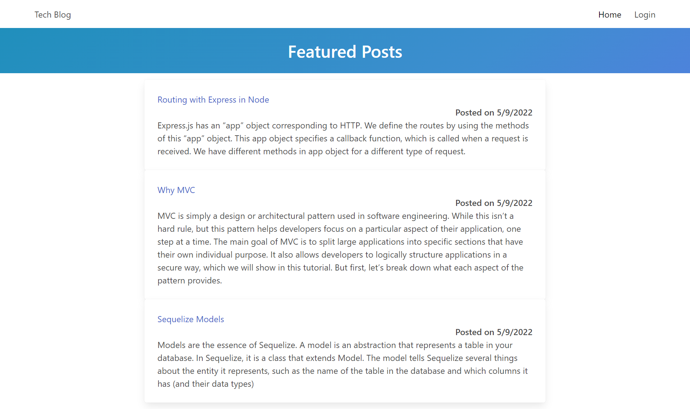
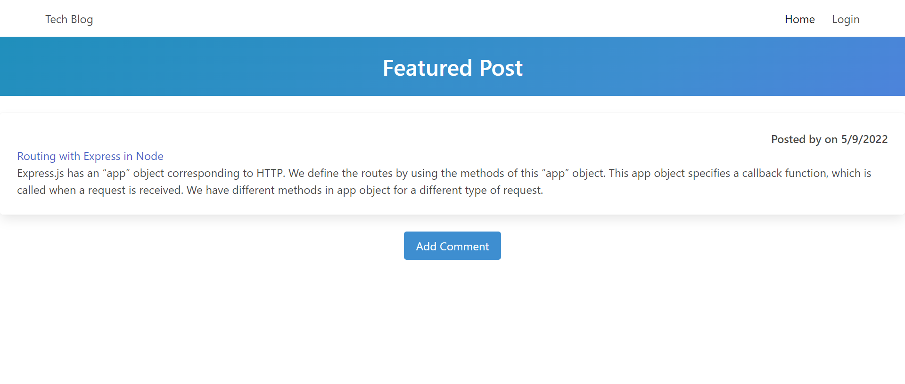
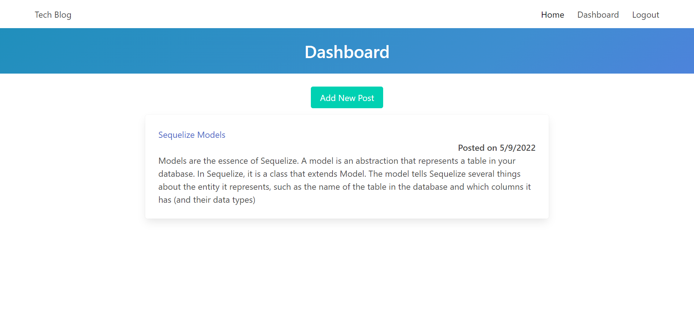
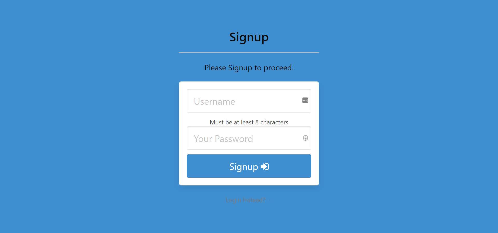
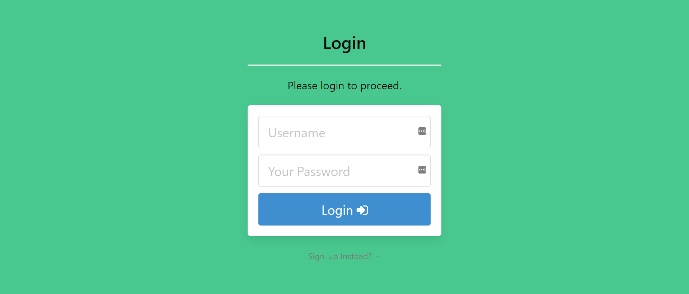

  # Tech Blog

   [](https://opensource.org/licenses/MIT)

   [Live-link](https://mvc-avm-tech-blog-post.herokuapp.com/)
  
  ## Table of Contents 

  * [Description](#description)

  * [Screenshot](#screenshot)
  
  * [Installation](#installation)
  
  * [Usage](#usage)
  
  * [Contributing](#contributing)

  * [License](#license)

  * [Questions](#questions)

  ## Description

  This project is similar to a wordpress site, where developers in the tech industry can publish their blog posts. Also, developers can comment on other posts on the web page. This app follows the MVC (model-view-controller) that uses technologies like handlebars, node js, mysql, sequelize and other npm packages. The deployed app is on Heroku, so for a note, it might take a few seconds to load up. 

  ## Screenshot

  Here are a couple of screenshots from the deployed application. 

  Home page: 
  
  

  Single post: 
  
  

  Dashboard: 

  

  Sign-up: 

  

  Login: 

  

  
  ## Installation 

  To install the necessary dependencies, run the following command:
  
  ```Dependencies
   npm i
  ```  
  ## Usage

  To use this repo, make sure you have all the necessary packages installed. Also, creating a mysql database will be needed with password and username to that database.
  
  ## Contributing

  If you would like to contribute, please email me.
  
  ## License

  This project is licensed under the MIT license 

  ## Questions
  
  If you have any questions about the repo, open an issue contact me directly at [midthun23@gmail.com](mailto:midthun23@gmail.com). You can find more work at [midth002](https://github.com/midth002)
  
